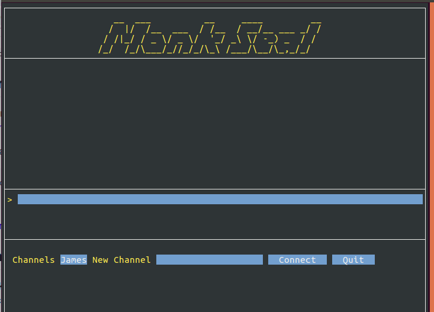

# MonkSeal Messenger :satellite:
Peer to peer messaging application written in Go.

If you like it, fork it! Clone it! Help build it! :raised_hands:

## Build Instructions
```
git clone https://github.com/jamesthesken/monk-seal.git
cd monk-seal
go get
go build

```

## Run the Gui

`./monk-seal`


## Screenshots & Update 11/02/19
Unfortunately I only have the GUI talking with a client that isn't Monk Seal :( .. So I started up a terminal running a [libp2p example](https://github.com/libp2p/go-libp2p-examples/tree/master/chat-with-rendezvous)

At least it talks over IPFS nodes and can be across networks.

```
./chat -rendezvous "monkseal"

```



## What's with the name?
Monk seals are common in the Hawaiian Islands. Although they look soft, they won't hesitate to bark in your face if they get the chance. 

:max_bytes(150000):strip_icc()/gettyimages-520524448-57c99c025f9b5829f4ddcd97.jpg)

## Thank you!
Credit to: [libp2p](https://github.com/libp2p/go-libp2p-examples/tree/master/chat-with-mdns) who provided the example which will serve as the groundwork for MonkSeal.

